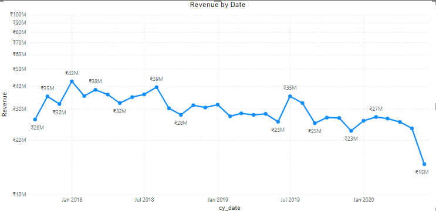
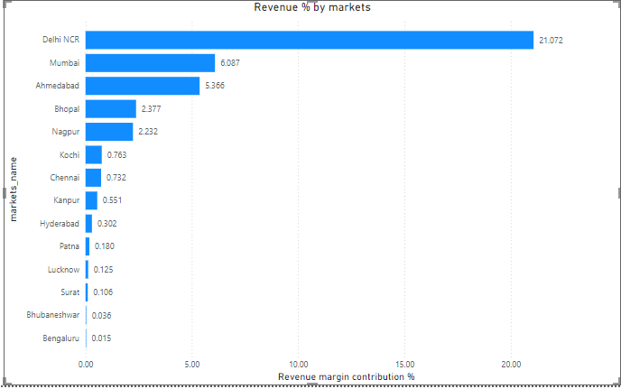
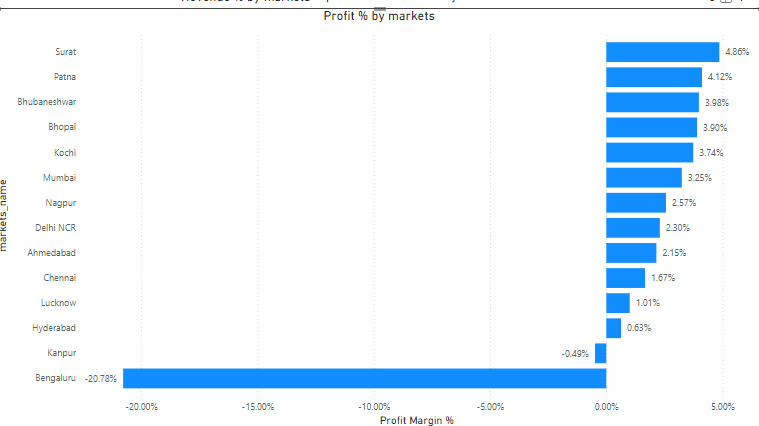
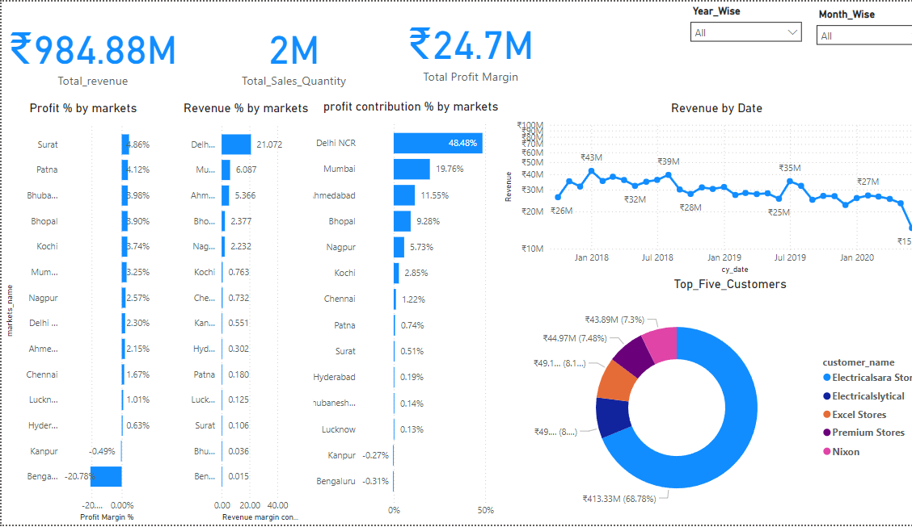

# Project: Sales Insights For Atliq Hardware Company

## Table of Contents
1. [Overview](#overview)
2. [Data Structure & Initial Checks](#data-structure--initial-checks)
3. [Findings and Recommendations](#findings-and-recommendations)
4. [Conclusion](#conclusion)
5. [Acknowledgments](#acknowledgments)

## Overveiw
**Atliq Hardware, an India-based company,** is seeking to gain a deeper understanding of the factors contributing to its **declining sales** and **profitability.** The company aims to analyze various aspects of its business, including **regional sales performance, customer behavior,** and **market trends.** By obtaining these insights, **Atliq Hardware plans to enhance its overall profitability and refine its sales strategies.** This data-driven approach will enable the company to make informed decisions and improve its competitive edge in the market.

## Key Objectives:

1. **Analyze Regional Sales Performance**  
   - Identify regions with declining sales and profitability.
   - Compare performance across different regions to pinpoint opportunities for improvement.

2. **Assess Profit Margins**  
   - Identify areas where profitability can be improved and develop strategies for margin optimization.

3. **Optimize Store and Product Performance**  
   - Analyze store performance to understand which stores are contributing most to revenue.
   - Determine underperforming products and identify opportunities to increase sales.

By addressing these objectives, we aim to provide Atliq Hardware with the insights needed to optimize their sales operations and drive business growth.

The **SQL** queries used to **analyze and clean** the data can be found [here](https://github.com/Maaz-Umar-00/Sales-Insights-For-Atliq-hardware/blob/main/03_Sales_insights_in_python-sql.ipynb).

[Click here to Download the  **Power Bi** Dashboard](https://github.com/Maaz-Umar-00/Sales-Insights-For-Atliq-hardware/blob/main/02_Atliq_hardware_sales_project.pbix)

## Data Structure & Initial Checks
The dataset used for this analysis is sourced from [https://codebasics.io/resources/sales-insights-data-analysis-project]) and it includes **Five tables**.

## Findings and Recommendations
1.# Atliq Hardware Revenue Analysis

- **Atliq Hardware's revenue peaked at $43 million in 2018, but declined by approximately 65% to $15 million by 2020.**
- **Atliq Hardware** could consider implementing a subscription model for regular customers, allowing them to receive monthly supplies at a discounted rate, thereby ensuring steady revenue. 

2. **Atliq Hardware** receives the highest revenue from **Delhi NCR**, where profits are also higher; however, the **profit margin** is surprisingly very low. 

To address this issue, the company should analyze cost structures in the region to identify inefficiencies and explore opportunities for reducing operational costs. Additionally, focusing on premium product offerings could enhance profit margins while attracting discerning customers.

 
3. **The highest profit margin** for Atliq Hardware is from **Surat city**, showcasing strong profitability. However, in contrast, the profit margin in **Bengaluru** is declining and moving into the **negative.** 

To mitigate the declining profits in **Bengaluru,** the company should reassess its pricing strategy and consider reducing non-essential expenditures in that region. Additionally, conducting a market analysis to understand **changing customer preferences** could help identify new opportunities for growth.

 

4.**Overall Business Metrics**

     
To Download the **Power Bi Dashboard**, please click [here](https://github.com/Maaz-Umar-00/Sales-Insights-For-Atliq-hardware/blob/main/02_Atliq_hardware_sales_project.pbix)\
To Veiw the  **Sql queries** click [here](https://github.com/Maaz-Umar-00/Sales-Insights-For-Atliq-hardware/blob/main/03_Sales_insights_in_python-sql.ipynb)

## Conclusion

This analysis provides a comprehensive view of Atliq Hardware's **sales performance**, highlighting both **strengths** and areas for **improvement**. While regions like **Surat** demonstrate strong **profit margins**, locations such as **Bengaluru** require immediate attention due to **declining profitability**. The insights suggest a need for strategic adjustments in **marketing**, **cost management**, and **customer engagement**. By acting on these recommendations, Atliq Hardware can **optimize operations**, improve **profit margins**, and work towards **sustainable growth** across all regions.

## Acknowledgments
* [code_basics](https://codebasics.io/resources/sales-insights-data-analysis-project) for providing the dataset.
* **Power Bi** and **sql** for visualization and insights.

